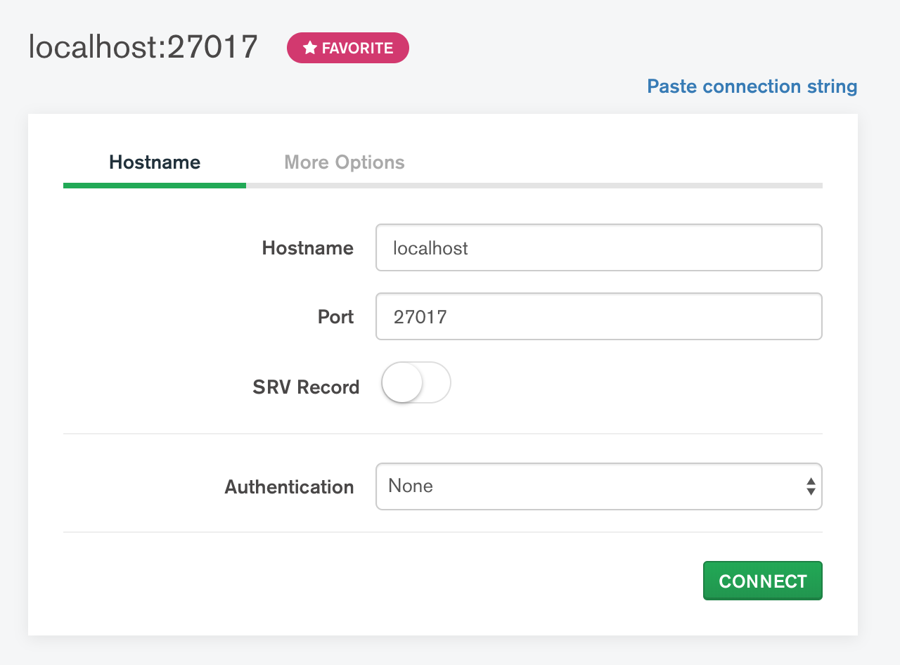

# Exchange4Students

SSW-322 Engineering Design VI Final Project

## Running the Project

_Prereq: make sure you have pip installed, refer to documentation [here](https://pypi.org/project/pip/) for instructions_

1. Clone this repository

```
git clone https://github.com/elenirotsides/Exchange4Students.git
```

2. Navigate into the project

```
cd Exchange4Students
```

3. Install the required packages

```
pip install -r requirements.txt
```

4. Navigate into the src folder and then run the flask server

```
cd src
python app.py
```

**or**

If you have python 2 and python 3 installed, python 2 will most likely be the default (unless you've changed the default to be python 3), so you need to make sure you're using python 3 to run this application.

```
cd src
python3 app.py
```

## Mongo Setup

In order to test, you need to make sure you have MongoDB installed, see https://docs.mongodb.com/manual/administration/install-community/ for details. I also recommend installing MongoDB Compass Community (https://docs.mongodb.com/compass/master/install/), which is basically a GUI for Mongo. I prefer Compass over the traditional way of interacting with Mongo, which is via the command line.

By default, Mongo will run on port 27017, so don't change that because that's what the code references right now.

When you open MongoDB Compass, it'll ask you to enter the `Connection String`. Here are what my settings look like:



FYI: I don't use my local instance of MongoDB for any intense dev work, which is why I don't have anything selected for the Authentication field.

**I recommend saving your connection string as a favorite in Compass, so you don't have to keep typing stuff in each time you want to connect to the database**
